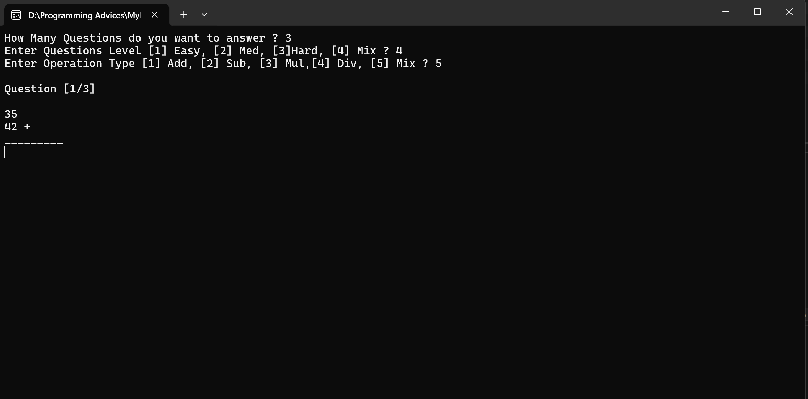
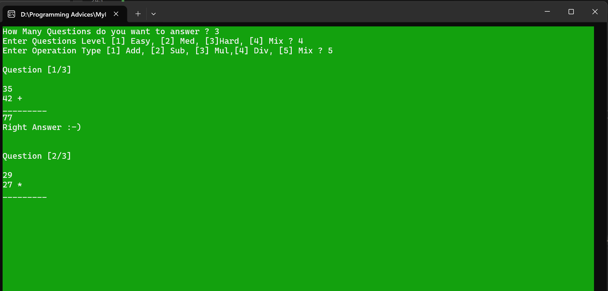
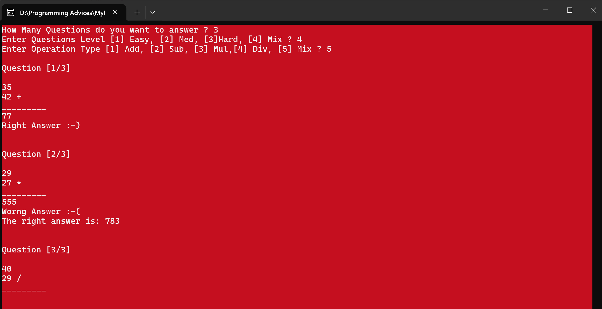
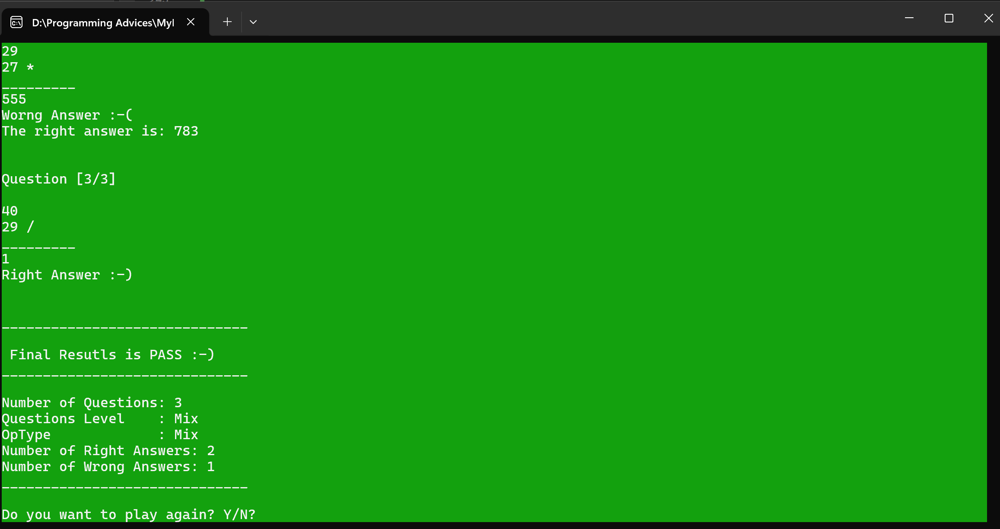

# Math Quiz Game in C++

## 📌 Project Description
A simple interactive math quiz game built with C++.  
Players can choose:
- The number of questions (1 to 10)
- Question difficulty level (Easy, Medium, Hard, or Mixed)
- Operation type (Addition, Subtraction, Multiplication, Division, or Mixed)

After answering all the questions, the game displays the final score, the number of correct and wrong answers, and whether the player passed or failed.

---

## 🎮 How to Play
1. When the game starts, you will be prompted to:
   - Enter the number of questions.
   - Choose the difficulty level.
   - Choose the type of operation.
2. Questions will be displayed one by one.
3. After each answer, feedback will be shown (correct or wrong).
4. At the end, a summary of your performance will be displayed.
5. You can choose to play again or exit.

---

## 🛠️ Features
- Multiple difficulty levels.
- Multiple math operation types.
- Random question generation.
- Colored console output for correct/wrong answers.
- Final score summary.

---

## 🚀 How to Run
1. Open the project in Visual Studio.
2. Build and Run the project.
3. Follow on-screen instructions to play.

---

## 📷 Example Output (Screenshots)

  <h2>📸 Game Screenshots</h2>
  
  

    
    
    
    
  
